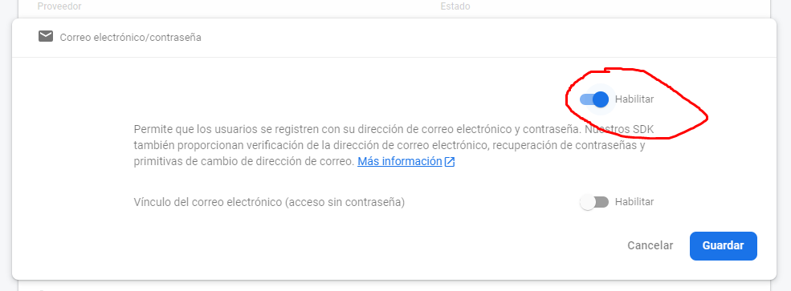
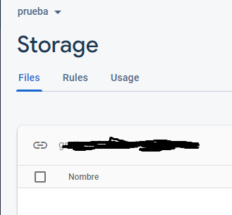
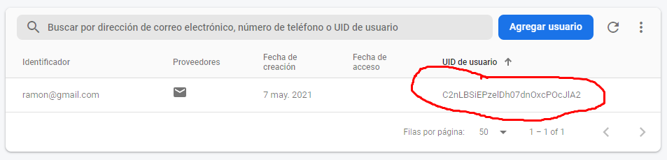
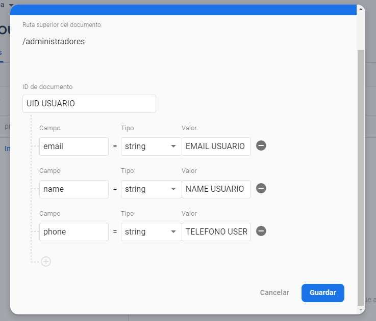

# Inventario

Aplicacion en Flutter para util para tiendias de tamaño medio.

_Funciones_
* la administración de inventarios,
* la administración de ventas,
* pubicación de inventario en pagina web [Pagina inventario](https://github.com/AlonsoAlvarez/pagina-inventario)
* generación de resivos de compra y venta en .pdf
* genera .pdf cada semana con el registro competo de ventas realizadas esa semana
* separacion de usuarios en Administradores y Empleados

## Comenzando 🚀

- Descargar y descomprimir el proyecto

### Pre-requisitos 📋

_Necesario_

```
- Entusiasmo jeje (XD)
- Flutter instalado
- Cuenta gmail
- Experiencia con Firebase
```

### Instalación 🔧

_Pasos para correr proyecto_

_1. Ve a [Firebase Console](https://console.firebase.google.com)_

```
- Crea un nuevo proyecto
- Agregar Firebase a nuestra App
```

_2. Agregar Authentication y activar correo electronico y contraseña



_3. Agregar Storage al proyecto y copiar la ruta de acceso


```
- Crea el archivo /lib/constants/storage.dart
- Colocar: const Bucket = "TU RUTA DE ACCESO";
- Guardar
```

## Ejecutando las pruebas ⚙️

_1. Inicia la alpicación en modo debug desde tu IDE (VSC o Andorid Studio)_

_2. Agrega un Administrador_

```
- Ve a Authentication en Firebase
- Agrega un nuevo usuario con email y contraseña
- Copia en UID de usuario
```


```
- Ve a Firestore en Firebase
- Inicia una coleccion llamada "administradores"
- Agregamos un documento. El ID será el UID de usuario antes creado
- En el documento agregaremos los campos "email", "name" y "phone", todos tipo String 
```



## Despliegue 📦

_Crea la Aplicación en modo release con el comando "flutter build apk" o conectando tu celular al ordenador con "flutter run --release"_

_Iniciar Sesion con las credenciales del administrador previamente agregado y divertirse_

## Construido con 🛠️

_Para este proyecto se utilizó_

* [Flutter](https://flutter.dev/)
* [Firebase](https://console.firebase.google.com/)

## Autores ✒️

_Mencion a todos aquellos que ayudaron a levantar el proyecto desde sus inicios_

* **Alonso Alvarez** - *Codificacion* - [AlonsoAlvarez](https://github.com/AlonsoAlvarez)


---
⌨️ con ❤️ por [AlonsoAlvarez](https://github.com/AlonsoAlvarez) 😊# Inventario-open-source
